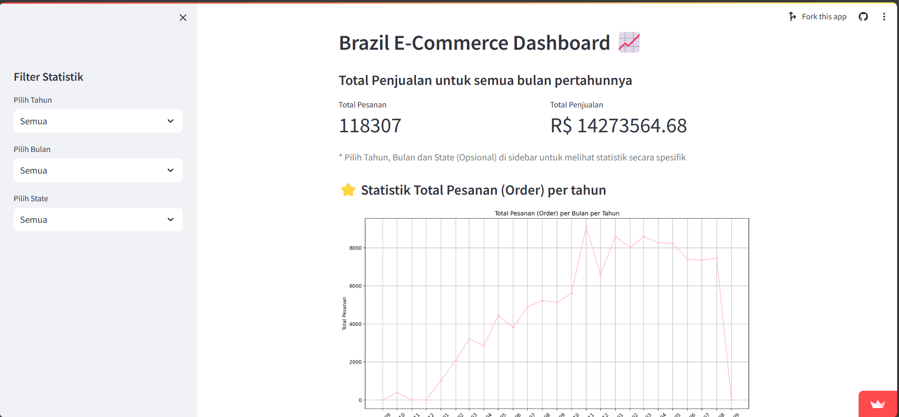

# Dicoding Data Analysis Project


Access dashboard in here [https://brazil-ecommerce-dashboard.streamlit.app/](https://brazil-ecommerce-dashboard.streamlit.app/).

## Overview
This is a data analysis project created to fulfill the task in the Data Science training program organized by Dicoding. The project aims to analyze e-commerce data in Brazil using various data analysis techniques and tools.

## Requirements
To run this project, make sure you have a complete Python installation, then install the required libraries. You can install the necessary libraries by running the following command:

```bash
pip install -r requirements.txt
```

The contents of `requirements.txt` are as follows:

```plaintext
matplotlib==3.6.3
numpy==1.23.5
pandas==2.0.3
seaborn==0.13.2
streamlit==1.31.1
```

## How to Run
You can access this Streamlit dashboard in several ways:

### 1. Using Git
First, clone the repository from GitHub:

```bash
git clone https://github.com/wansabrina/Proyek-Analisis-Data-Dicoding.git
```

Then, navigate to the `Dashboard` directory:

```bash
cd Dashboard
```

Finally, run the following command to launch the Streamlit application:

```bash
streamlit run dashboard.py
```

### 2. Using Streamlit Sharing
You can also visit [https://brazil-ecommerce-dashboard.streamlit.app/](https://brazil-ecommerce-dashboard.streamlit.app/) to view this project's dashboard directly through Streamlit Sharing.
